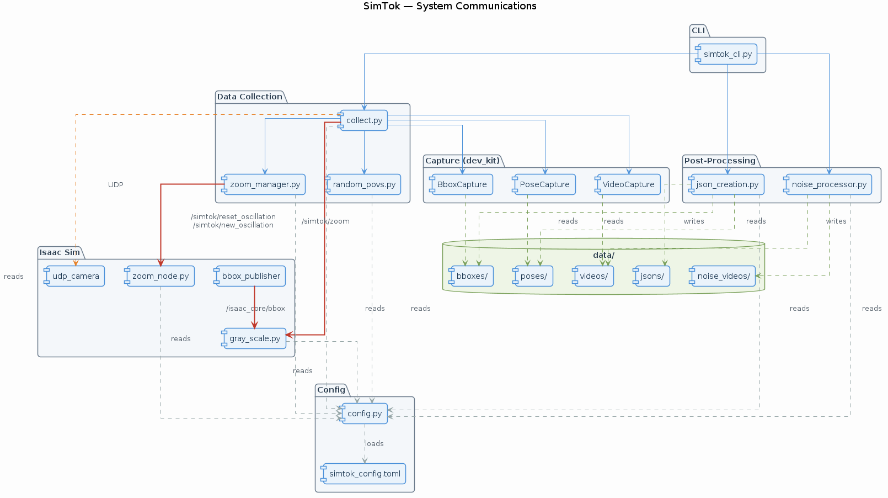

# SimTok

---

## Table of Contents 📑

1. [What is SimTok?](#what-is-simtok)
2. [System overview](#system-overview)
3. [System requirements](#system-requirements)
4. [How to use the system?](#how-to-use-the-system)
5. [How to test the code?](#how-to-test-the-code)

---

## What is SimTok?

SimTok is a tool for generating thermal data using `Issacsim` based on `Isaac Core 2023`.

---

## System overview

### Pipeline

#### 1. Simulating and collecting data

The tool captures grayscale videos of a wall usd that are supposed to mimic real thermal camera videos and preserve metadata.

The videos are captured from two `POVS`:
1. A **fixed** camera `POV` directed right at the target (a wall).
2. A camera `POV` that varies in angles and distance from target.

The metadata is being saved as `pkl` files, preserving `Pose` and `Bbox`.
- `Pose` being camera orientation and global location.
- `Bbox` being distance from target in each axis, whether target is in frame, whether its visible (target may be in frame but hidden behind another object).

#### 2. Adding noise to videos

The captured videos are being processed and new copies of them are being created with pre-configured noise.
Noise models may vary and work in their own sort of `pipeline`.
Noise models may include:
`DeadPixelsNoise`, `HotPixelsNoise`, `GaussianNoise` etc...

#### 3. Saving MetaData as json

The `pkl` files are being processed and the `metadata` is being saved as `json` files. The `json` files contain only the required metadata and exclude irrelevant information such as `global camera location`.

---

### Scripts and nodes

As well as files included in `Isaac Core 2023`, `SimTok` adds multiple scripts that some of them contain several nodes.

> #### `simtok_cli.py`
>
> Creates a user interface cli tool to activate and pass parameters to each of the steps in the `pipeline` mentioned in `Pipeline` chapter.
> Essentially wraps all steps in a configurable `pipeline`.

> #### `collect.py`
>
> Handles running the simulation and collecting data.
>
> Provides an `API` `DataCollector` `ROS2` node.
> the node uses `HostIsaacManager` to run isaac sim with a pre-configured `usda` file.
> uses, `VideoCapture`, `PoseCapture` and `BboxCapture` for filming and collecting metadata.
>
> > **Note:** Oscillations - a calculated change of shade in the usd prim.
>
> Requests new oscillations whenever a new `sample` begins.
> A `Sample` is the combination of two `Povs` sharing the same oscillation.
>
> Resets oscillation between each `POV` to keep the same exact data just from a different angle.

> #### `gray_scale.py`
>
> A `script node` running from an action graph in `Isaacsim` that creates oscillations, and restarts them according to the `isaac_core/bbox topic` from which the `euclidean distance` is calculated, from the distance a gray fading is calculated using the following formula:
>
> ```
> new_gray_value = gray_value * math.exp(-alpha * distance)
> ```
>
> This script colors the `prim` according to the `thermal fade` and the current offset value (current oscillation value).
>
> Subscribes to `/simtok/new_oscillation` and `/simtok/reset_oscillation` to know when to create a new oscillation and when to reset it.

> #### `zoom_node.py`
>
> A `script node` running from the action graph in `Isaacsim`.
> Subscribes to `/simtok/zoom` via `ROS2`, receives a zoom value (0.0–1.0), converts it to a focal length using a geometric lens model, and applies it to the camera prim's `focalLength` attribute.

> #### `zoom_manager.py`
>
> Provides an `API` (`ZoomCommander`) to publish zoom values to `/simtok/zoom` via `ROS2`. Supports both immediate zoom changes and smooth slewing to a target value. Used by `collect.py` to control the camera zoom during data collection.

> #### `noise_processor.py`
>
> Provides an `API` for a video processing `pipeline` that adds pre-configured `thermal noise`.

> #### `noise_models.py`
>
> Provides `noise models` classes that inherit from an abstract `NoiseModel` class.
> Each class adds a different type of `thermal noise`.

> #### `json_creation.py`
>
> Provides an `API` for a json convertor of pkl `metadata` to `json`, extracts only necessary data.

> #### `simtok_config.toml`
>
> Holds a toml configuration for the entire `simtok` project.

> #### `config.py`
>
> Provides an easy access to configuration values without having to get all of them in each script.

### System communication


---




## System requirements

* python3==3.10
* isaac_core_dev_kit
* ROS2-humble
* tomli
* cv2

## How to use the system?

The system runs from a single entrypoint; `simtok_cli.py` and can execute each step of the `pipeline` mentioned earlier, with a different cli arg, for example:

* `python3 simtok_cli.py run-all` runs the entire process

* `python3 simtok_cli.py collect` runs only the simulation and collecting data

* `python3 simtok_cli.py json` runs only `json` conversion of `metadata`

* `python3 simtok_cli.py noise` runs only the new processed videos with `thermal noise` creation.


Each one of the possible scenarios has its own sub-arguments, such as:
`duration`, `--num-samples`, `--data-root`...
If none of the arguments are chosen, the system will use the default arguments in `simtok_config.toml`.

---

## How to test the code?

The test suite lives in the `tests/` directory and is run with `pytest`. You **must** scope the run to `tests/` so that only the project's own tests are collected (the vendored `docker/` extensions ship their own tests that are not part of SimTok and will fail to import):

```bash
pytest tests/
```

Useful variations:

* `pytest tests/ -v` — verbose, one line per test.
* `pytest tests/test_collect.py` — run a single test module.
* `pytest tests/ -k random` — run only tests whose name matches `random`.

> **Note:** Do not run bare `pytest` from the project root — it will try to collect the vendored Cesium/Omniverse tests under `docker/` and error out. Always target `tests/`.

The suite covers the configuration layer (`test_config.py`), the UDP bot math (`test_udp_bot.py`), the noise models (`test_noise_models.py`), the JSON metadata conversion (`test_json_creation.py`), the random POV generator (`test_random_povs.py`), and the data collector's initialization/resolution logic (`test_collect.py`).


